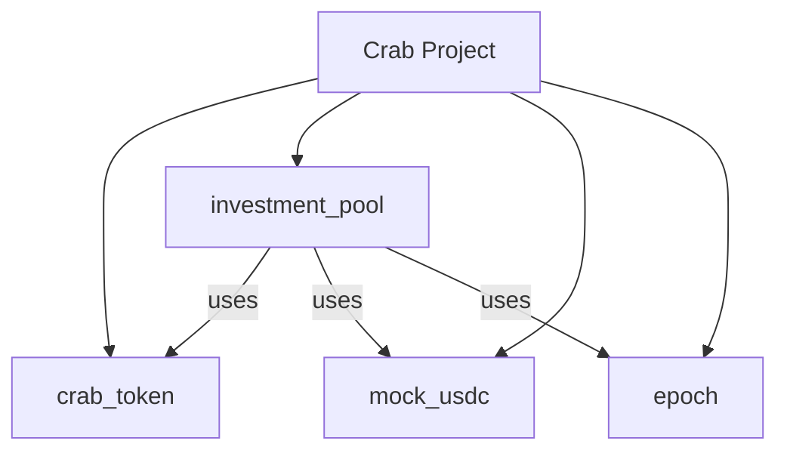

# Seafloor Smart Contract Aptos

## Overview

The seafloor smart contract is a decentralized investment platform that allows businesses to tokenize their assets and investors to invest in these businesses using USDC. The platform uses CRAB tokens to represent investments and manages a liquidity pool for handling transactions.

## Transaction Explorer: View Contract on Aptos Explorer
(https://explorer.aptoslabs.com/account/0x18b9dccee7eb6726b6688b91a7c9e7e66c6ed3c33755e34f220d97dd1504c6e4?network=devnet)

## Contract Structure

The contract consists of four main modules:

1. `crab_token`: Manages the CRAB token
2. `investment_pool`: Handles the core investment logic
3. `mock_usdc`: Simulates USDC for testing purposes
4. `epoch`: Manages time-based operations

### Visual Representation

## Key Functions

### crab_token Module

- `initialize`: Sets up the CRAB token
- `mint`: Creates new CRAB tokens
- `burn`: Destroys CRAB tokens

### investment_pool Module

- `initialize`: Sets up the investment pool
- `register_business`: Registers a new business and mints initial CRAB tokens
- `invest`: Allows investors to invest USDC in a business
- `divest`: Allows investors to sell their CRAB tokens and receive USDC
- `distribute_profits`: Adds profits to the pool
- `distribute_profits_to_users`: Distributes profits to investors based on their stakes

### mock_usdc Module

- `initialize`: Sets up the mock USDC token
- `mint`: Creates new mock USDC tokens

### epoch Module

- `initialize`: Sets up the epoch system
- `now`: Returns the current epoch
- `to_epoch`: Converts a timestamp to an epoch number

## User Roles

1. **Admin**: Manages the platform, registers businesses, and handles profit distribution
2. **Business**: Represents their assets as CRAB tokens on the platform
3. **Investor**: Invests USDC in businesses and receives CRAB tokens

## Investment Flow

1. Admin initializes the contract
2. Admin registers businesses, minting initial CRAB tokens for them
3. Investors use USDC to invest in businesses, receiving CRAB tokens
4. Businesses can add profits to the pool
5. Admin distributes profits to investors based on their stakes
6. Investors can divest by selling their CRAB tokens back for USDC
